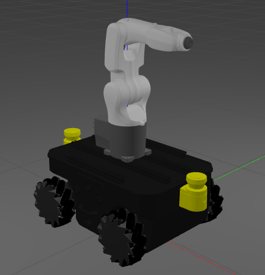
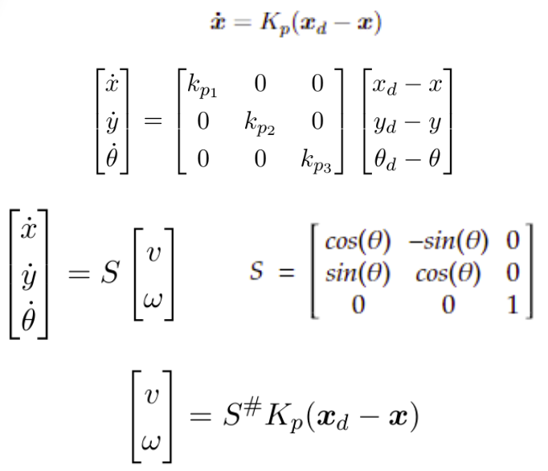

This project is part of the Fundamentals of Robotics course at UTEC. The objective of the work is to carry out an analysis of the structure of the robot of 6 degrees of freedom by direct and inverse kinematics, as well as the control by inverse kinematics. Likewise, detail the dynamic analysis as its respective control. Finally, visualize the results in Rviz as in Gazebo.

The robot is composed of 2 commercial robots: the KUKA KR4 Agilus and the Neobotix MPO-500. In this work, we attach the KUKA robot on top of the Neobotix. So, we will do the kinematic control of the moving platform with a proportional control.

The whole proccess is described in the following pdf file (spanish)

<iframe src="Proyecto_Fundamentos.pdf" height="500" width="900"></iframe>

The code can be located __[here](https://github.com/manul30/fdr_manipulator_movil_robot)__.

[projectRepo]: https://github.com/manul30/Flutter-bobelto
[postSVM]: 
